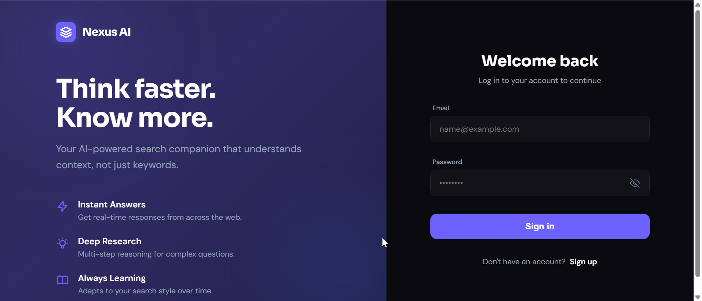
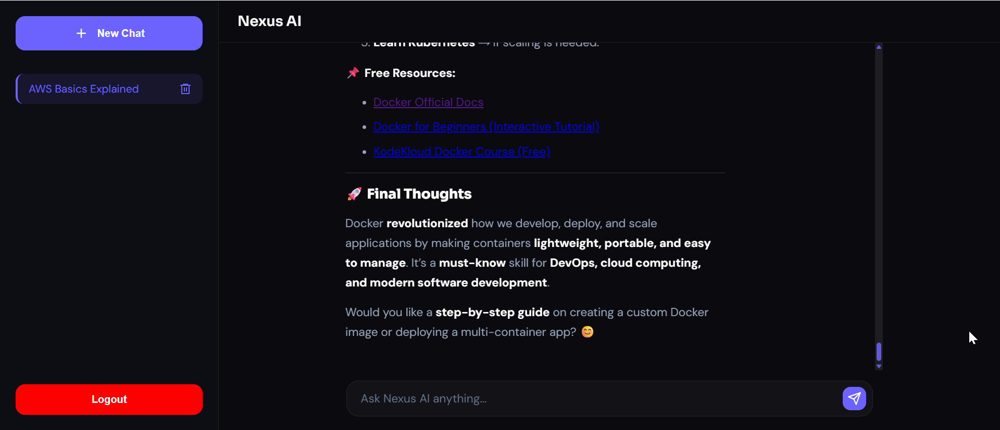

# NexusAI — AI-Powered Chat Platform

> Think faster. Know more.  
> Your AI-powered chat companion that understands context, not just keywords.

## 🚀 Live Demo
🔗 [nexusai.vercel.app](https://nexusai.vercel.app)

---

## ✨ Features

- 🤖 **AI Chat** — Powered by Mistral AI with real-time streaming responses via SSE
- 💬 **Multi-Chat Support** — Create and manage multiple conversations
- 📜 **Conversation History** — Per-user chat history stored in MongoDB
- 🔐 **Email Authentication** — Register, verify email, and login securely
- 🛡️ **JWT Auth** — Access/refresh token system with secure HTTP-only cookies
- 🔒 **Password Security** — Hashed with bcrypt

---

## 🛠️ Tech Stack

### Frontend
- React.js, Redux Toolkit
- CSS / Custom Styling
- Deployed on **Vercel**

### Backend
- Node.js, Express.js
- MongoDB (Mongoose)
- Mistral AI API
- SSE (Server-Sent Events)
- Deployed on **Render**

---

## ⚙️ Getting Started

### Prerequisites
- Node.js v18+
- MongoDB Atlas account
- Mistral AI API key

## 📸 Screenshots

| Login Page | Chat Interface |
|------------|---------------|
|  |  |

---

## 👨‍💻 Developer

**Muhammad Bilal**  
[LinkedIn](https://linkedin.com/in/mbilal412) • [GitHub](https://github.com/mbilal412)